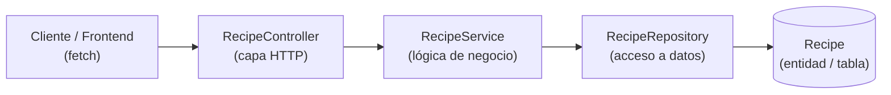
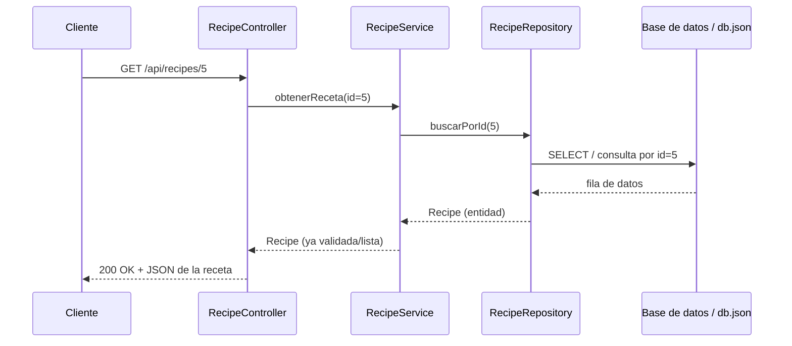

# Semana 6 — Arquitectura en capas de una API

> **CONFIG:** FULL_NAME: `Cristian Andres Muñoz Montenegro` · GITHUB_USER: `cristianmunoz2006`

## Caso elegido: API de Recetario

Se reutiliza el caso del **Recetario** (ya usado en la Semana 3), ahora
diseñando cómo se vería su API en capas: `controller → service →
repository → entity`.

## Diagrama de capas



La petición siempre entra por el `Controller` y baja capa por capa hasta
la `Entity`; la respuesta sube de regreso por el mismo camino.

## Responsabilidad de cada capa

| Capa | Responsabilidad | Lo que NO hace |
|---|---|---|
| **Controller** (`RecipeController`) | Recibe la petición HTTP, lee parámetros (id, body, query), llama al Service y devuelve la respuesta (código de estado + JSON). | No contiene lógica de negocio ni sabe cómo se guardan los datos. |
| **Service** (`RecipeService`) | Contiene la lógica de negocio: valida reglas (ej. dificultad válida), calcula el tiempo total (`prepTime + cookTime`), decide si una operación es posible. Orquesta al Repository. | No conoce HTTP (ni request/response) ni el detalle de la base de datos. |
| **Repository** (`RecipeRepository`) | Se encarga solo del acceso a datos: consultar, guardar, actualizar o borrar en la base de datos (o en `db.json` vía json-server). Traduce entre la entidad y el almacenamiento. | No valida reglas de negocio ni sabe nada de HTTP. |
| **Entity** (`Recipe`) | Representa el modelo de datos: `id`, `name`, `cuisine`, `difficulty`, `prepTimeMinutes`, `cookTimeMinutes`, `ingredients`. | No tiene comportamiento de negocio ni de acceso a datos. |

## Endpoint de ejemplo

**`GET /api/recipes/5`** — obtener la receta con id 5.



**Por qué pasa por cada capa:**

1. **Controller:** recibe `GET /api/recipes/5`, extrae `id = 5` de la
   URL.
2. **Service:** pide la receta al Repository; si no existe, decide
   devolver un error de "no encontrado" en vez de romper la app.
3. **Repository:** hace la consulta real contra la base de datos (o
   `db.json`) buscando el registro con `id = 5`.
4. **Entity:** los datos crudos se convierten en un objeto `Recipe` con
   sus atributos ya tipados.
5. La respuesta sube de regreso: Repository → Service → Controller,
   que finalmente arma el `200 OK` con el JSON para el cliente.

Si la receta no existe, el flujo es el mismo hasta el Repository, pero
el Controller responde `404 Not Found` en vez de `200 OK`.

## Cómo se versionó con Git

```bash
git clone <URL-de-tu-fork>
cd <carpeta-del-repo>
# coloca esta entrega dentro de la carpeta 06-week/
git add .
git commit -m "Entrega semana 06"
git push origin main
```
